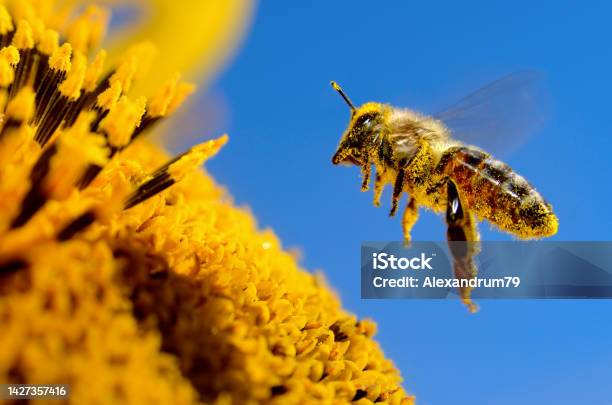

# The World of Bees

## Welcome to "The World of Bees" project! This project aims to explore and showcase the fascinating world of bees.

## Table of Contents
- [The World of Bees](#the-world-of-bees)
  - [Welcome to "The World of Bees" project! This project aims to explore and showcase the fascinating world of bees.](#welcome-to-the-world-of-bees-project-this-project-aims-to-explore-and-showcase-the-fascinating-world-of-bees)
  - [Table of Contents](#table-of-contents)
  - [Introduction](#introduction)
  - [Features](#features)
  - [Installation](#installation)
  - [Usage](#usage)
  - [Contributing](#contributing)
  - [License](#license)
  - [Author](#author)
  - [© 2023 SALIHA BRIK | The World of Bees. All rights reserved.](#-2023-saliha-brik--the-world-of-bees-all-rights-reserved)

## Introduction
In this project, we delve into the intricate lives of bees and their importance in our ecosystem. We will cover various topics such as bee species, their behavior, pollination, and the threats they face.

## Features
- Detailed information about different bee species
- Interactive visualizations showcasing bee behavior
- Educational resources on beekeeping and conservation

## Installation
To get started with "The World of Bees" project, follow these steps:
1. Clone the repository: `git clone https://github.com/your-username/your-repo.git`
2. Install the required dependencies: `npm install`

## Usage
Once you have installed the project, you can run it using the following command:
`node app.js`

## Contributing
If you would like to contribute to the project, please follow the [contributing guidelines](CONTRIBUTING.md)

## License
This project is licensed under the [MIT License](LICENSE)

## Author
- [Saliha Brik](https://github.com/salihabrik)

&copy; 2023 SALIHA BRIK | The World of Bees. All rights reserved.
- 
